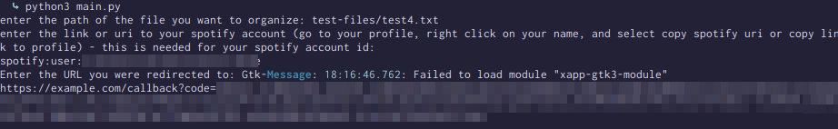
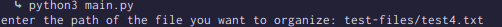
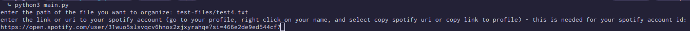

<!-- Improved compatibility of back to top link: See: https://github.com/othneildrew/Best-README-Template/pull/73 -->
<a id="readme-top"></a>
<!--
*** Thanks for checking out the Best-README-Template. If you have a suggestion
*** that would make this better, please fork the repo and create a pull request
*** or simply open an issue with the tag "enhancement".
*** Don't forget to give the project a star!
*** Thanks again! Now go create something AMAZING! :D
-->

# *IMPORTANT*: Currently, this project does not work due to a rework in Spotify's API that causes spotipy to no longer search correctly, among other things. I am currently working to migrate to directly using Spotify's API to avoid further incidences

<!-- PROJECT SHIELDS -->
<!--
*** I'm using markdown "reference style" links for readability.
*** Reference links are enclosed in brackets [ ] instead of parentheses ( ).
*** See the bottom of this document for the declaration of the reference variables
*** for contributors-url, forks-url, etc. This is an optional, concise syntax you may use.
*** https://www.markdownguide.org/basic-syntax/#reference-style-links
-->

<div align="center">
    <a href="https://github.com/yugms/spotify-song-parser/graphs/contributors"></a>
    <a href="https://github.com/yugms/spotify-song-parser/network/members"></a>
    <a href="https://github.com/yugms/spotify-song-parser/stargazers"></a>
    <a href="https://github.com/yugms/spotify-song-parser/issues"></a>
    <a href="https://github.com/yugms/spotify-song-parser/blob/master/LICENSE.txt"></a>
  </div>


<!-- PROJECT LOGO -->
<br />
<div align="center">
  <a href="https://github.com/yugms/spotify-song-parser">
    
  </a>

  <p align="center">
    add songs to/create spotify playlists with just a text file
    <br />
    <a href="https://github.com/yugms/spotify-song-parser/issues/new?assignees=&labels=&projects=&template=bug_report.md&title=">Report Bug</a>
    ·
    <a href="https://github.com/yugms/spotify-song-parser/issues/new?assignees=&labels=&projects=&template=feature_request.md&title=">Request Feature</a>
  </p>
</div>


<!-- TABLE OF CONTENTS -->
<details>
  <summary>Table of Contents</summary>
  <ol>
    <li>
      <a href="#about-the-project">About The Project</a>
      <ul>
        <li><a href="#built-with">Built With</a></li>
      </ul>
    </li>
    <li><a href="#prerequisites">Prerequisites</a></li>
    <li><a href="#installation">Installation</a></li>
    <li><a href="#tutorial">Tutorial</a></li>
    <ul>
      <li><a href="#text-file-formatting">Text File Formatting</li>
      <li><a href="#step-1">Step 1</li>
      <li><a href="#step-2">Step 2</li>
      <li><a href="#step-3">Step 3</li>
      <li><a href="#step-4">Step 4</li>
    </ul>
    <li><a href="#roadmap">Roadmap</a></li>
    <li><a href="#contributing">Contributing</a></li>
    <li><a href="#license">License</a></li>
    <li><a href="#contact">Contact</a></li>
    <li><a href="#acknowledgments">Acknowledgments</a></li>
  </ol>
</details>


<!-- ABOUT THE PROJECT -->
## About The Project



This program takes a text file (more info about formatting in the [tutorial section](#tutorial)) and adds songs to the playlists you specified. I made this because I sometimes don't have access to data so I can just write this text file, and when I have internet I can run the code and easily get my songs added to my playlists. The [test files](./test-files/) are used for testing to make sure the program still works after testing. The project uses spotipy to authenticate and handle the spotify api.

<p align="right">(<a href="#readme-top">back to top</a>)</p>

### Built With

* [![Python]][Python-url]
* [![Spotipy]][Spotipy-url]
* [![Spotify]][Spotify-url]

<p align="right">(<a href="#readme-top">back to top</a>)</p>

## Prerequisites

In order to run this project, you need to have Python 3.10+ and have created a spotify app (more instructions at [installation](#installation)) You can download the latest version of python at [python.org][Python-url]

  ```sh
  $ python --version
    3.10 (or greater)
  ```

## Installation

1. Create an app for free at the [Spotify Developer Dashboard](https://developer.spotify.com/dashboard/create) (the name, description, and redirect uri can be random, just save the redirect uri and set the "apis used" to web api)
2. Clone the repo and cd into the project directory
   ```sh
   git clone https://github.com/yugms/spotify-song-parser.git
   cd spotify-song-parser/
   ```
3. Create a python environment and install pip packages
   ```sh
   python3 -m venv <environment-name>
   source <environment-name>/bin/activate
   pip install -r requirements.txt
   ```
4. Create a `.env` file with your client id, client secret, and redirect uri
   ```env
   SPOTIFY_CLIENT_ID="spotify client id"
   SPOTIFY_CLIENT_SECRET="spotify client secret"
   SPOTIFY_REDIRECT_URI="redirect uri (make sure it is the same as in your dashboard)"
   ```
5. Change git remote url to avoid accidental pushes to base project
   ```sh
   git remote set-url origin github_username/repo_name
   git remote -v # confirm the changes
   ```

<p align="right">(<a href="#readme-top">back to top</a>)</p>


<!-- USAGE EXAMPLES -->
## Tutorial
#### Text file formatting
This is assuming that you have completed the [installation steps](#installation).

In order to use the program you need to have a properly formatted text file.
The formatting method:
```
Songs:
  <song> / playlist1 playlist2 playlist3... !main_playlist (if you don't want that song to be in the main playlist)
  ...
Artists:
  <artist> / playlist1 playlist2 playlist3... !main_playlist (if you don't want that song to be in the main playlist)
```
Currently you cannot disable not having a main playlist and the main playlist name must be "songs"

You also do not need to have 3 playlists per song, it can only be one if you want.

#### Step 1
Start the program by typing `python3 main.py` in the project directory, and enter the file path for the files you have. I would recommend creating a "files" directory inside of the project directory or somewhere else in your file system to be easily able to enter the path.



#### Step 2
Next, enter either the link to your spotify profile, your profile uri, or your profile id.
To get the link to your profile or uri, follow the instructions [here](https://scribehow.com/shared/Copying_a_Spotify_Profile_Link__giLYh47MSr-rbo8zE7CEsg)



#### Step 3
Now, if you have already used the program, there should be a cache file in the directory containing the access token already and the program should automatically add all the songs to your playlist. However, if you have not, then your browser will open, and you will be prompted to sign in and authorize the application with your spotify account (don't worry, the program won't delete everything, and if it does, please report it in the issues). After that, copy the link in the url bar and paste it into the program.


#### Step 4
If everything works hunky-dory, it should print out text saying `success`. You are now good to go!

<p align="right">(<a href="#readme-top">back to top</a>)</p>


<!-- ROADMAP -->
## Roadmap

- [ ] MOST IMPORTANT: Migrate to directly handling spotify API to replace spotipy
- [ ] Add more features regarding the "main" playlist
  - [ ] Allow for no main playlist
  - [ ] Allow for custom main playlist names
- [ ] Enable multi-word playlists
- [ ] Add top songs of each artist to playlists
- [ ] Connect user caches to a database for more security and easier to manage files

See the [open issues](https://github.com/yugms/spotify-song-parser/issues) for a full list of proposed features (and known issues).

<p align="right">(<a href="#readme-top">back to top</a>)</p>


<!-- CONTRIBUTING -->
<a id="contributing"></a>
## Contributing

Contributions are what make the open source community such an amazing place to learn, inspire, and create. Any contributions you make are **greatly appreciated** especially because I am still learning how to develop and this is my first (somewhat) major project.

If you have a suggestion that would make this better, please fork the repo and create a pull request. You can also simply open an issue with the tag "enhancement".
Don't forget to give the project a star! Thanks again!

1. Fork the Project
2. Create your Feature Branch (`git checkout -b feature/AmazingFeature`)
3. Commit your Changes (`git commit -m 'Add some AmazingFeature'`)
4. Push to the Branch (`git push origin feature/AmazingFeature`)
5. Open a Pull Request

<p align="right">(<a href="#readme-top">back to top</a>)</p>

### Top contributors:

<a href="https://github.com/yugms/spotify-song-parser/graphs/contributors">
  
</a>


<!-- LICENSE -->
## License

Distributed under the MIT license. See `LICENSE.txt` for more information.

<p align="right">(<a href="#readme-top">back to top</a>)</p>


<!-- CONTACT -->
## Contact

Yugm Shah - yugsha28@gmail.com

Project Link: [https://github.com/yugms/spotify-song-parser](https://github.com/yugms/spotify-song-parser)

<p align="right">(<a href="#readme-top">back to top</a>)</p>


<!-- ACKNOWLEDGMENTS -->
## Acknowledgments

* [othnieldrew](https://github.com/othneildrew) for the [README template](https://github.com/othneildrew/Best-README-Template/tree/main)
* This could be you! Try [contributing](#contributing)

<p align="right">(<a href="#readme-top">back to top</a>)</p>


<!-- MARKDOWN LINKS & IMAGES -->
<!-- https://www.markdownguide.org/basic-syntax/#reference-style-links -->

[Python]: https://img.shields.io/badge/Python-FFD43B?style=for-the-badge&logo=python&logoColor=306998
[Python-url]:  https://www.python.org/
[Spotipy]: https://img.shields.io/badge/Spotipy-1DB954?style=for-the-badge&logo=python&logoColor=FFD43B
[Spotipy-url]: https://github.com/spotipy-dev/spotipy
[Spotify]: https://img.shields.io/badge/Spotify%20Api-000000?style=for-the-badge&logo=spotify&logoColor=1DB954
[Spotify-url]: https://developer.spotify.com/documentation/web-api